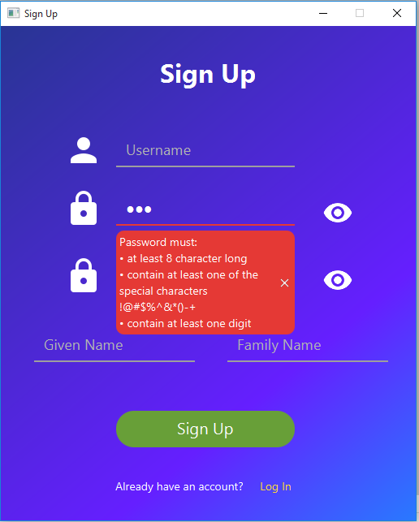
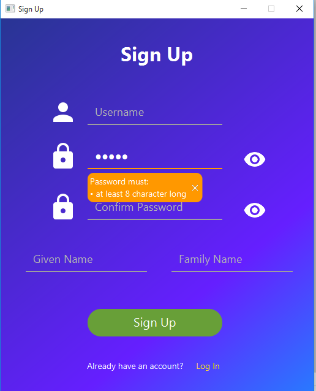

<h2>JavaFX SignIn SignUp</h2>
This is Sample sign in sing up GUI application designed using
Java jdk14 and OpenJavaFX 11.0.2.

Features of this sample applications are:

*  stylish design with animation
* floating messages for input field hits and error messages
* infinite circular progress bar with transitions 
* animated status to indicate task status - error or successful
* toggling password visibility

<h5>Screen Shots</h5>

<table>
<thead>
<tr>
<td><b>Name</b></td>
<td><b>Screen Shot</b></td>
</tr>
</thead>
<tbody>
<tr>
<td>Sign in screen</td>
<td>  </td>
</tr>
<tr>
<td>Username Hint</td>
<td></td>
</tr>
<tr>
<td>Visible Password Field</td>
<td></td>
</tr>
<tr>
<td>Weak Password Field</td>
<td></td>
</tr>
<tr>
<td>Moderate Password Field</td>
<td></td>
</tr>
<tr>
<td>Strong Password Field</td>
<td></td>
</tr>
<tr>
<td>Confirm Password Hint</td>
<td></td>
</tr>
<tr>
<td>Input Error Message</td>
<td></td>
</tr>
<tr>
<td>Progress Bar Running</td>
<td></td>
</tr>
<tr>
<td>Status Error</td>
<td></td>
</tr>
<tr>
<td>Status Successful</td>
<td></td>
</tr>
</tbody>
</table>

For demo video of running application please visit the <a href="https://drive.google.com/file/d/18tMnv8wXA_SbUSOVDhI4vLppic6bEXa-/view?usp=sharing">link</a>

<b><i>Note:</i></b> you are free to use and update this project but please don't merge your code to the master branch.

```
 Copyright 2021 rahulstch

 Licensed under the Apache License, Version 2.0 (the "License");
 you may not use this file except in compliance with the License.
 You may obtain a copy of the License at

     http://www.apache.org/licenses/LICENSE-2.0

 Unless required by applicable law or agreed to in writing, software
 distributed under the License is distributed on an "AS IS" BASIS,
 WITHOUT WARRANTIES OR CONDITIONS OF ANY KIND, either express or implied.
 See the License for the specific language governing permissions and
 limitations under the License.
```

 


